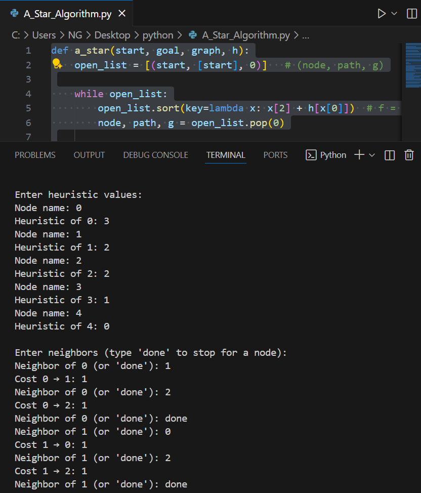
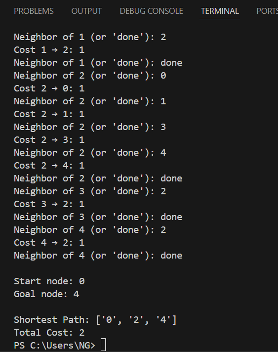

# A* Search Algorithm (A-Star)

A* Search is a best-first search algorithm that finds the shortest path from a start node to a goal node using both the cost to reach a node (g) and a heuristic estimate to the goal (h). It combines the advantages of Dijkstra’s algorithm and Greedy Best-First Search.

1. How it works
- Initialize an open list with the start node and a closed list as empty.
- Repeat:
- Select the node with the lowest f = g + h from the open list.
- Move it to the closed list.
- Expand its neighbors, calculate f = g + h, and add unvisited nodes to the open list.
- Stop when the goal node is selected for expansion.

2. Source code
- File: [a_star.py](./A_Star_Algorithm.py)
- Language: Python (version: 3.x)

3. Applications
- Pathfinding in maps and grids (games, robotics)
- Route optimization (GPS navigation)
- AI problem solving (puzzles, logistics)

4. Complexity
- Time complexity: O(b^d) in worst case (b = branching factor, d = depth)
- Space complexity: O(b^d) — stores all generated nodes

5. Example input & output
(Include an image showing the input graph or grid and program output)





6. How to run
```bash
python3 A_Star_Algorithm.py
# or
python A_Star_Algorithm.py

