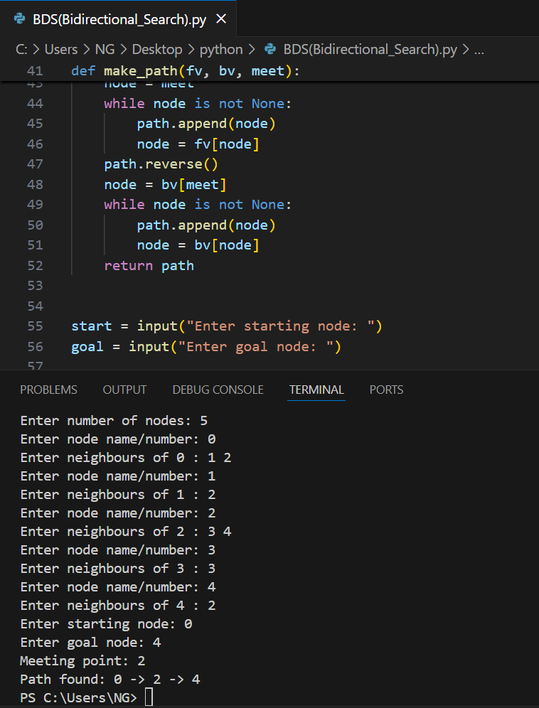

# Bidirectional Search

Bidirectional Search is an AI search algorithm that runs two simultaneous searches: one forward from the start node and one backward from the goal node. The search stops when the two meet, reducing the search space compared to traditional BFS.

1. How it works
- Initialize two frontiers: one from the start node and one from the goal node.
- Expand nodes alternately from both frontiers.
- Keep track of visited nodes in both directions.
- Stop when a node appears in both visited sets — the path is found.

2. Source code
- File: [bidirectional.py](./BDS(Bidirectional_Search).py)
- Language: Python (version: 3.x)

3. Applications
- Shortest path search in undirected graphs
- Pathfinding in AI and robotics
- Networking and routing optimization

4. Complexity
- Time complexity: O(b^(d/2)) — exponential reduction compared to BFS
- Space complexity: O(b^(d/2)) — needs to store visited nodes in both directions

5. Example input & output
(Include an image showing the input graph and program output)




7. How to run
```bash
python3 BDS(Bidirectional_Search).py
# or
python BDS(Bidirectional_Search).py
