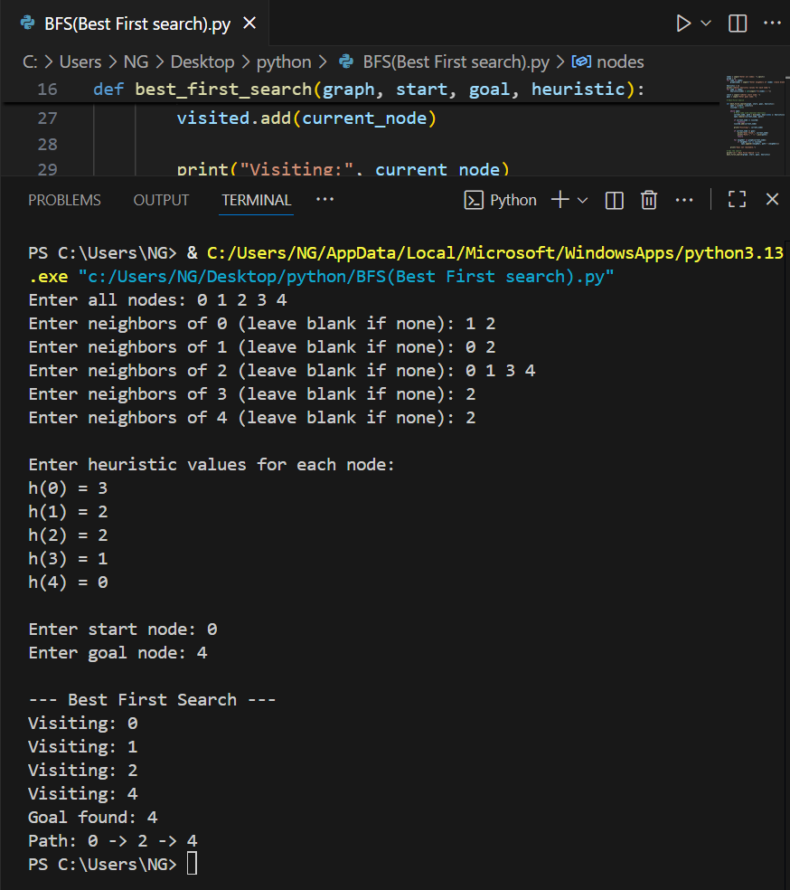

# Best-First Search

Best-First Search is a heuristic search algorithm that explores a graph by expanding the most promising node first, based on a heuristic function (h) that estimates the cost to reach the goal. It is similar to A* but focuses only on the heuristic.

1. How it works
- Initialize an open list with the start node.
- Repeat:
- Select the node with the lowest heuristic value h from the open list.
- Move it to the closed list.
- Expand its neighbors and add unvisited nodes to the open list.
  3. Stop when the goal node is selected for expansion or the open list is empty.

2. Source code
- File: [Best_First_Search.py](./BFS(Best_First_Search).py)
- Language: Python (version: 3.x)

3. Applications
- Pathfinding in games and robotics
- AI problem solving where heuristic guidance is available
- Optimization problems (finding best solutions quickly)

4. Complexity
- Time complexity: O(b^d) in worst case (b = branching factor, d = depth)
- Space complexity: O(b^d) — stores all generated nodes

5. Example input & output
(Include an image showing the input graph or grid and program output)




6. How to run
```bash
python3 BFS(Best_First_Search).py
# or
python BFS(Best_First_Search).py

