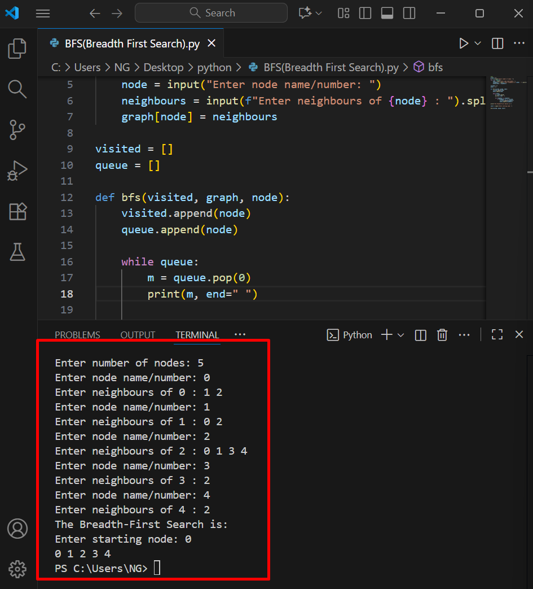
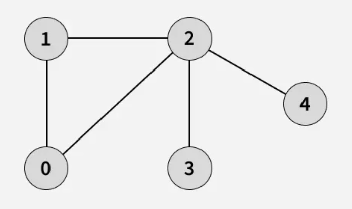

# Breadth-First Search (BFS)

Breadth-First Search (BFS) explores a graph level by level using a FIFO queue. It finds the shortest path on unweighted graphs.

1. How it works
  1. Enqueue the start node.
  2. Repeat:
     - Dequeue the front node.
     - Visit all unvisited neighbors and enqueue them.
  3. Stop when the goal is found or the queue is empty.

   
2. Source code
- File: `BFS(Breadth First Search).py`
- Language: Python (version: 3.x)

3. Applications
- Shortest path in unweighted graphs
- Crawling / level-order processing
- Networking broadcast

4. Complexity
- Time complexity: O(V + E)
- Space complexity: O(V)

5. Example input & output
(Include an image showing the input graph and program output)



8. How to run
```bash
python3 bfs.py
# or
python bfs.py

