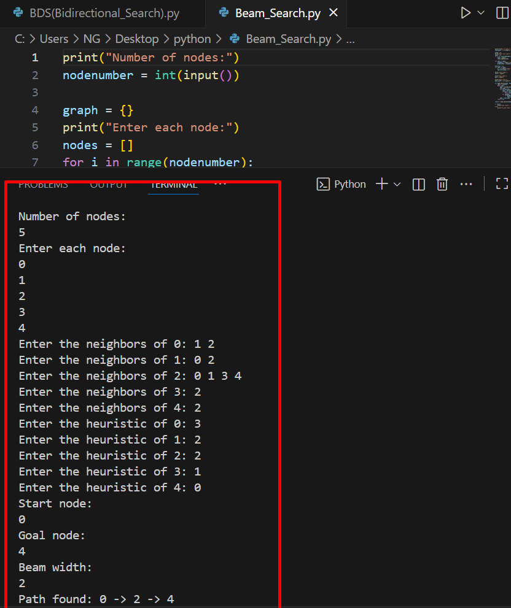

# Beam Search

Beam Search is a heuristic search algorithm that explores a graph by expanding only a limited number of the best nodes at each level (the beam width). It balances between breadth-first search and greedy search, reducing memory usage while still considering multiple paths.

1. How it works
- Initialize a queue with the start node.
- At each level, generate all successors of nodes in the queue.
- Sort successors based on a heuristic function.
- Keep only the top `k` nodes (beam width) for the next level.
- Repeat until the goal is found or the queue is empty.

2. Source code
- File: [beam_search.py](./Beam_Search.py)
- Language: Python (version: 3.x)

3. Applications
- Natural language processing (e.g., machine translation, text generation)
- Speech recognition
- Pathfinding in AI with large state spaces

4. Complexity
- Time complexity: O(b * k * d) — b = branching factor, k = beam width, d = depth
- Space complexity: O(k) — only stores top k nodes at each level

5. Example input & output
(Include an image showing the input graph or sequence and program output)




6. How to run
```bash
python3 Beam_Search.py
# or
python Beam_Search.py

