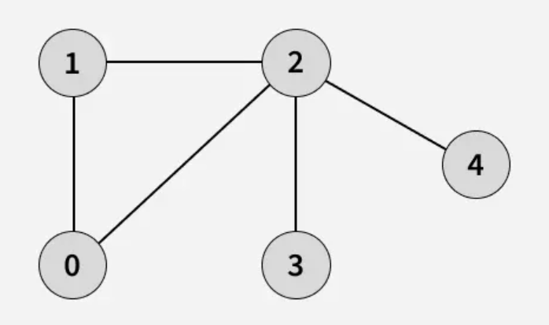
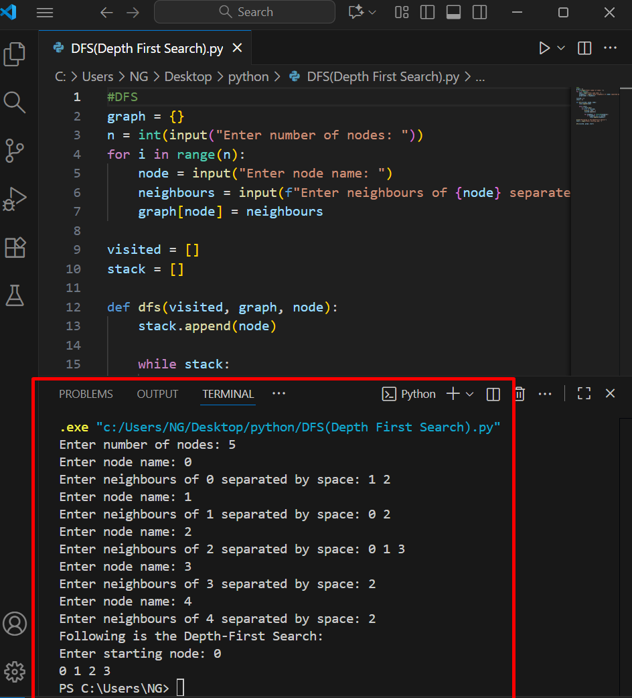

# Depth-First Search (DFS)

Depth-First Search (DFS) explores a graph by going as deep as possible along each branch before backtracking. It is useful for pathfinding and traversals in graphs and trees.

1. How it works
  - Push the start node onto a stack.
  - Repeat:
  - Pop the top node from the stack.
  - Visit all unvisited neighbors and push them onto the stack.
  - Stop when the goal is found or the stack is empty.

2. Source code
- File: [dfs.py](./DFS(Depth_First_Search).py)
- Language: Python (version: 3.x)

3. Applications
- Pathfinding in mazes and graphs
- Topological sorting
- Cycle detection in graphs

4. Complexity
- Time complexity: O(V + E)
- Space complexity: O(V) for stack (recursive DFS may also use call stack)

5. Example input & output
(Include an image showing the input graph and program output)



7. How to run
```bash
python3 dfs.py
# or
python dfs.py

