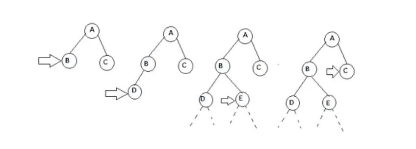
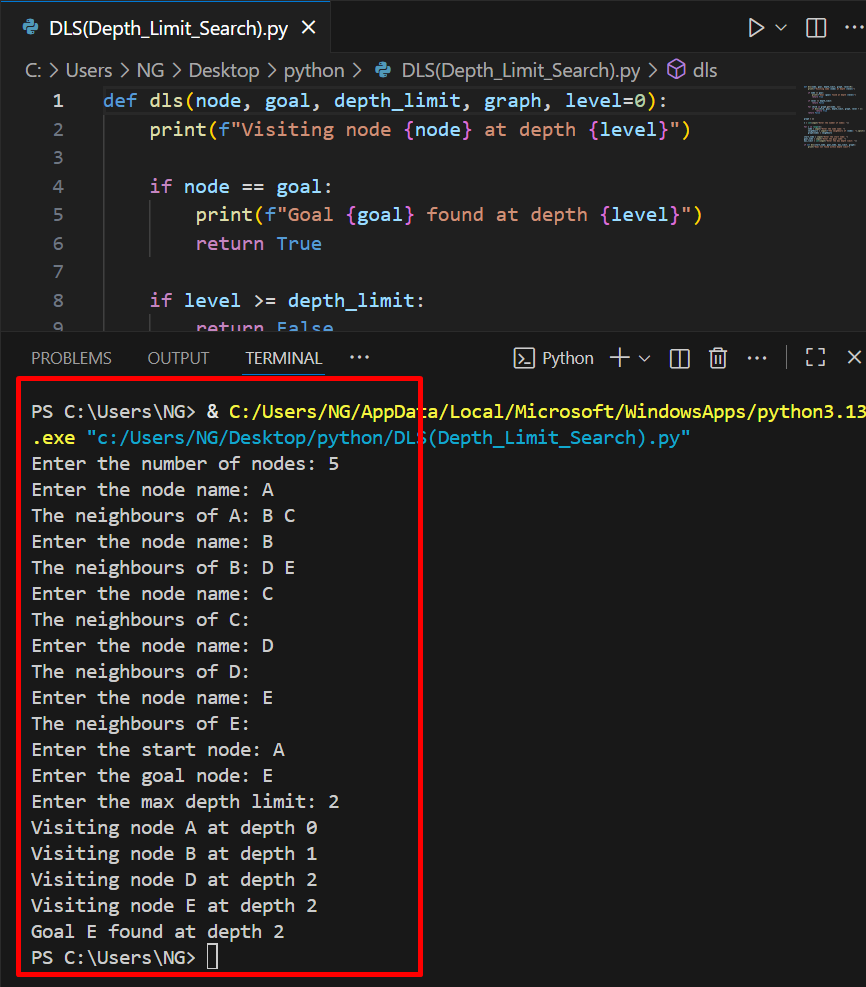

# Depth-Limited Search (DLS)

Depth-Limited Search (DLS) is a variation of Depth-First Search (DFS) where the search is restricted to a maximum depth. It avoids going infinitely deep in graphs with cycles or infinite paths.

1. How it works
- Push the start node onto a stack (or use recursion).
- Keep track of the current depth for each node.
- Visit neighbors only if the depth limit has not been reached.
- Stop when the goal is found, stack/recursion ends, or the depth limit is reached.

2. Source code
- File: [dls.py](./DLS(Depth_Limit_Search).py)
- Language: Python (version: 3.x)

3. Applications
- Searching large or infinite state spaces with depth limits
- Avoiding infinite loops in cyclic graphs
- Useful in AI game trees with maximum search depth

4. Complexity
- Time complexity: O(b^l) — where b is the branching factor, l is the depth limit
- Space complexity: O(l) for recursion stack

5. Example input & output
(Include an image showing the input graph and program output)




7. How to run
```bash
python3 dls.py
# or
python dls.py

