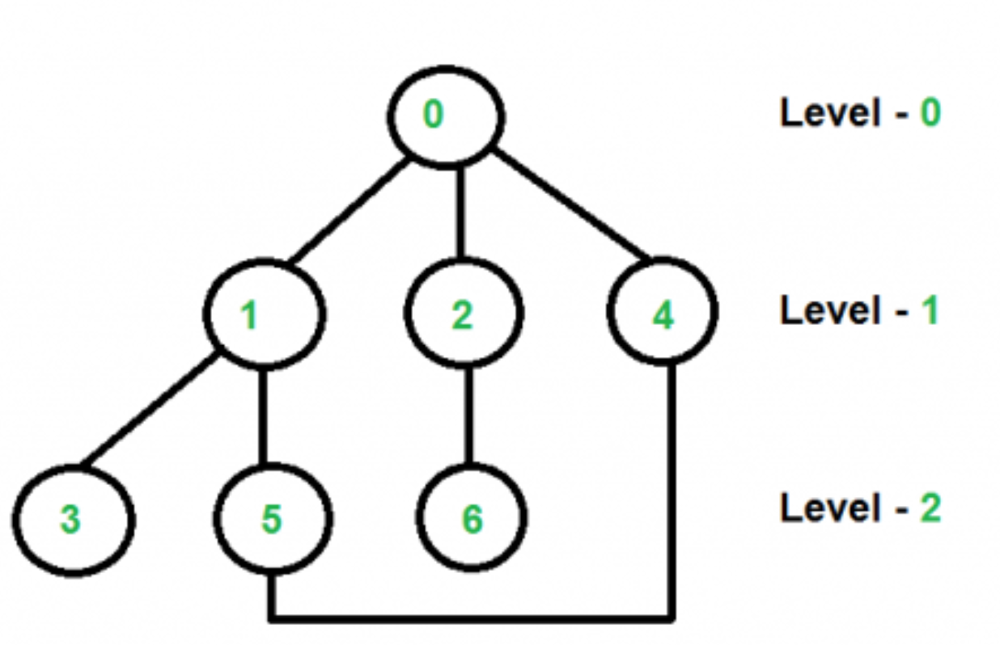
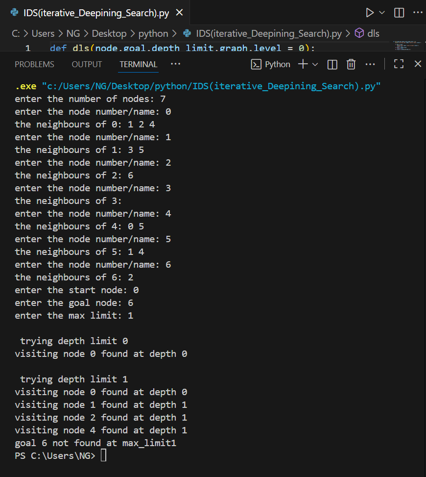

# Iterative Deepening Search (IDS)

Iterative Deepening Search (IDS) combines the benefits of Depth-First Search (DFS) and Breadth-First Search (BFS). It performs DFS repeatedly with increasing depth limits until the goal is found, ensuring completeness like BFS while using less memory.

1. How it works
- Start with depth limit = 0.
- Perform Depth-Limited Search (DLS) up to the current depth.
- If the goal is not found, increase the depth limit by 1 and repeat.
- Stop when the goal is found.

2. Source code
- File: [ids.py](./IDS(iterative_Deepining_Search).py)
- Language: Python (version: 3.x)

3. Applications
- Searching large or infinite state spaces
- Situations where memory is limited but completeness is required
- Solving puzzles and AI game trees

4. Complexity
- Time complexity: O(b^d) — repeated searches increase time, but asymptotically similar to BFS
- Space complexity: O(d) — only needs stack for current depth

5. Example input & output
(Include an image showing the input graph and program output)




6. How to run
```bash
python3 IDS(iterative_Deepining_Search).py
# or
python IDS(iterative_Deepining_Search).py

